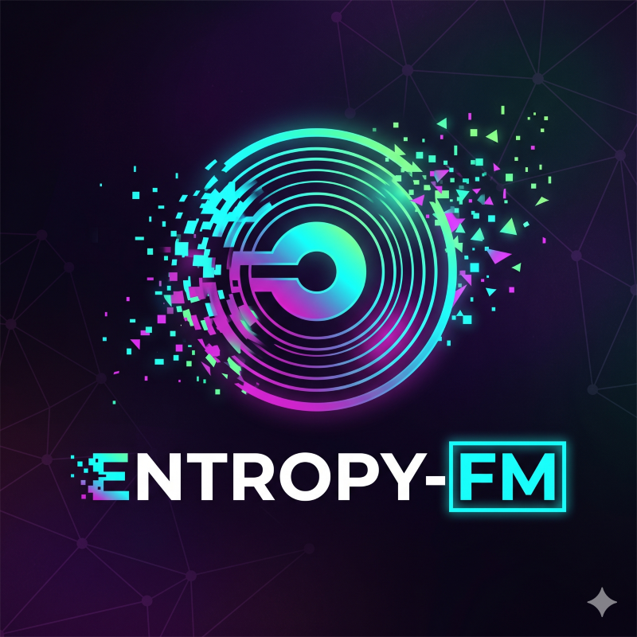

<p align="center">
  
</p>

# Entropy FM

**Entropy FM** is a music project and production archive for releases, audiovisual pieces, artwork, thumbnails, and related production material published through the **Entropy FM** channel.

The repository is organized as a media archive rather than a software package. Each musical project has its own directory, with audio, visual assets, and text or reference material separated by function. The public channel is available at [YouTube — Entropy FM](https://www.youtube.com/@entropyfm).

## Entropy FM channel

- **YouTube:** https://www.youtube.com/@entropyfm
- **Repository:** https://github.com/ozsp12/entropy_fm

## Current catalog

| Project | Material currently archived |
|---|---|
| **Eterno Retorno** | MP3 audio, square artwork, 16:9 visual assets |
| **I Left My Home — Army Cadence** | Reference/adaptation text, YouTube text version, 16:9 and 9:16 thumbnails |
| **Black Sun Spiral** | MP3 audio, 16:9 artwork, 9:16 artwork |
| **Lugar de Amigo** | MP3 audio, landscape image sequence, 9:16 image sequence |
| **Outcast Paradise** | MP3 audio, image sequence, thumbnail |

## Repository structure

```text
entropy_fm/
├── README.md
├── assets/
│   └── branding/
│       ├── entropy-fm.png
│       ├── entropy-fm-alt.png
│       └── entropy-fm-small.png
└── tracks/
    ├── eterno-retorno/
    │   ├── audio/
    │   └── artwork/
    │       ├── 1x1/
    │       └── 16x9/
    ├── i-left-my-home-army-cadence/
    │   ├── artwork/
    │   │   ├── 16x9/
    │   │   └── 9x16/
    │   └── text/
    ├── black-sun-spiral/
    │   ├── audio/
    │   └── artwork/
    │       ├── 16x9/
    │       └── 9x16/
    ├── lugar-de-amigo/
    │   ├── audio/
    │   └── artwork/
    │       ├── landscape/
    │       └── 9x16/
    └── outcast-paradise/
        ├── audio/
        └── artwork/
            └── sequence/
```

## Organization conventions

The repository follows a small set of conventions intended to keep future releases predictable and easy to maintain:

- Track directories use lowercase **kebab-case** names.
- Audio masters and publication files are stored under `audio/`.
- Visual assets are stored under `artwork/` and separated by aspect ratio when that information is known.
- Sequential images use zero-padded names such as `01.png`, `02.png`, and `03.png` instead of generic or automatically generated filenames.
- Channel-wide logos and visual identity files are stored under `assets/branding/`, independently of any individual track.
- Lyrics, adaptations, source notes, and other textual production material are stored under `text/`.

## Media storage

The repository currently stores MP3 and image assets directly in Git. This is practical at the present scale, but continued growth will eventually make ordinary Git history unnecessarily heavy. For a substantially larger catalog, **Git LFS** or release-oriented external storage should be considered for large binary assets while keeping metadata, documentation, and lightweight artwork in the repository.

## Copyright and reuse

Unless explicitly stated otherwise, the contents of this repository are **not released under an open-source or open-content license**. Original Entropy FM material remains under the rights of its respective author or creator.

Some directories may contain reference material, source text, adaptations, or other material associated with third-party works. Such material remains subject to the rights of the respective copyright holders. Its presence in this repository does not imply transfer of ownership or unrestricted permission for reuse or redistribution.

## Author

**Dr. Osvaldo L. Santos-Pereira** — [Academic webpage](https://ozsp12.github.io/) · [Lattes](http://lattes.cnpq.br/6730251976463283) · [ORCID](https://orcid.org/0000-0003-2231-517X) · [Google Scholar](https://scholar.google.com/citations?user=HIZp0X8AAAAJ&hl=en) · [ResearchGate](https://www.researchgate.net/profile/Osvaldo-Santos-Pereira) · [GitHub](https://github.com/ozsp12) · [LinkedIn](https://www.linkedin.com/in/ozsp12) · [Substack](https://substack.com/@olsp1982) · [Medium](https://medium.com/@ozsp12) · [YouTube](https://www.youtube.com/@ozlsp12) · [X](https://x.com/ozsp12)
